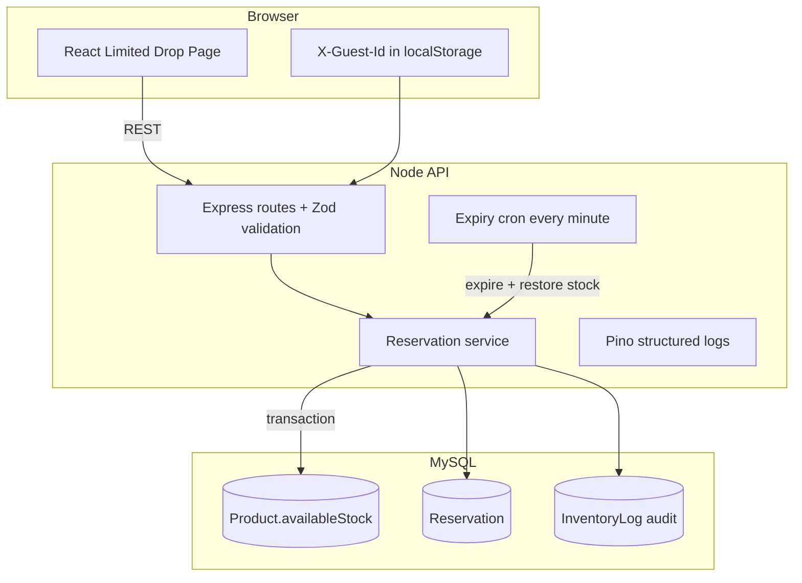

# StockGuard

Limited-stock product drop system for high-concurrency reservations. When many shoppers hit **Reserve** at the same time, inventory stays correct, holds expire after five minutes, and stock never goes negative.

| Link | URL |
|------|-----|
| Repository | [github.com/Habimana06/StockGuard](https://github.com/Habimana06/StockGuard) |
| Live demo (required) | **<!-- LIVE_DEMO_URL -->** _Paste your Pxxl URL here, e.g. `https://your-app.pxxl.app`_ |
| Loom walkthrough (required) | **<!-- LOOM_VIDEO_URL -->** _Paste your 5–8 min Loom link here_ |
| Architecture diagram | See [Architecture](#architecture) below (or add `docs/architecture.png`) |

## Environment files

| File | Purpose |
|------|---------|
| `backend/.env` | **API only** — `DATABASE_URL`, `JWT_SECRET`, `PORT`, etc. |
| `frontend/.env` | Optional — `VITE_API_URL` for `npm run dev` |
| `docker-compose.yml` | MySQL container users/passwords (not in `.env`) |

### MySQL credentials (Docker defaults)

| Role | User | Password | Database |
|------|------|----------|----------|
| **Root** (admin) | `root` | `62001` | — |
| **App** (API / Prisma) | `stockguard` | `stockguard` | `stockguard` |

**Host port:** `3307` (mapped to `3306` in the container — use `3307` in Workbench / local `DATABASE_URL`).

Use the **app** user in `DATABASE_URL`, not root.

## Quick start (Docker)

```bash
cp backend/.env.example backend/.env
# Edit backend/.env — set JWT_SECRET (16+ characters)
docker compose up --build
```

| Service | URL |
|---------|-----|
| Web UI | http://localhost:5173 |
| API | http://localhost:4000 |
| Health | http://localhost:4000/health |
| Metrics | http://localhost:4000/metrics |

### Local development (without Docker)

```bash
# Terminal 1 — database
docker compose up mysql -d

# Terminal 2 — API
cd backend && npm install
cp .env.example .env
npx prisma migrate deploy && npm run db:seed
npm run dev

# Terminal 3 — UI
cd frontend && npm install
cp .env.example .env
npm run dev
```

## Architecture



## API overview

| Method | Path | Description |
|--------|------|-------------|
| GET | `/health` | Liveness + DB check |
| GET | `/metrics` | Simple in-process counters |
| GET | `/products` | List products (pagination, filter, sort) |
| GET | `/products/:id` | Product + active reservation for user |
| POST | `/api/reserve` | Hold stock (`productId`, `quantity`) |
| POST | `/api/checkout` | Complete purchase (`reservationId`) |
| POST | `/auth/register` | JWT registration (bonus) |
| POST | `/auth/login` | JWT login (bonus) |

Send `X-Guest-Id` (any stable string ≥ 8 chars) for the drop page without login, or `Authorization: Bearer <token>` after auth.

## Race conditions — how we prevent overselling

1. **Atomic stock decrement** — `UPDATE product SET availableStock = availableStock - qty WHERE id = ? AND availableStock >= qty`. If zero rows match, the request fails with `409`. No read-modify-write race.
2. **Serializable business rules in one transaction** — duplicate active reservation check, decrement, reservation row, and inventory log are committed together.
3. **Expiry before reserve/checkout** — stale holds are released first so `availableStock` reflects reality.
4. **Concurrency test** — Vitest fires 25 parallel reserves on 10 units; exactly 10 succeed.

## Schema decisions

| Model | Why |
|-------|-----|
| **Product.availableStock** | Single counter for “what can still be reserved” — updated only inside transactions. |
| **Reservation** | Temporary hold with `expiresAt` and `status` lifecycle (`ACTIVE` → `COMPLETED` / `EXPIRED`). |
| **Order** | Immutable sale record linked 1:1 to a completed reservation. |
| **InventoryLog** | Append-only audit trail for reserve, release, checkout, seed. |
| **User** | Supports JWT accounts; guests map via `guest-{id}@stockguard.local` email upsert. |

## Trade-offs

| Choice | Benefit | Cost |
|--------|---------|------|
| MySQL row-level `updateMany` vs Redis lock | Strong consistency, simpler ops | DB becomes hot spot under extreme load |
| In-process cron vs queue | Easy Docker/Render deploy | Multiple API replicas need external cron or leader election |
| Guest header vs forced login | Faster UX for assessment demo | Weaker identity than full auth |
| In-memory `/metrics` | Zero dependencies | Not shared across instances |

## What breaks at ~10,000 concurrent users

- **MySQL connection pool** — default pool exhausts; queries queue and time out.
- **Single API instance** — CPU on JSON + Prisma; rate limiter is per-process.
- **Row lock contention** — all reserves hit one `Product` row for a drop.
- **Cron duplication** — N replicas expire the same rows unless only one runs cron.
- **No CDN/cache** — product reads hit DB every 5s per client.

## Scaling plan

1. **Read path** — cache product stock in Redis with short TTL; pub/sub push updates to websockets instead of 5s polling.
2. **Write path** — shard hot SKU or use Redis `DECR` + async Postgres reconciliation for drops.
3. **Workers** — move expiry to a dedicated job consumer (BullMQ / SQS).
4. **API** — horizontal pods behind load balancer; sticky sessions optional for guests.
5. **DB** — read replicas for listings; connection pooling (PgBouncer).
6. **Observability** — Prometheus + Grafana instead of in-memory counters.

## Testing

```bash
cd backend && npm test    # needs MySQL (docker compose up mysql -d)
cd frontend && npm test
```

## What is still required from you (submission)

Code in this repo is largely complete. **You** still need to finish these deliverables from the assessment brief:

| # | Deliverable | Status | What to do |
|---|-------------|--------|------------|
| 1 | **GitHub repo** | Done | [github.com/Habimana06/StockGuard](https://github.com/Habimana06/StockGuard) |
| 2 | **Live hosted app** | **You** | Deploy to [Pxxl](https://pxxl.app/) (see below) and paste URL in the table at the top |
| 3 | **Loom video (5–8 min)** | **You** | Record walkthrough; paste link in the table at the top |
| 4 | **Architecture diagram** | Partial | Mermaid diagram is in this README; optional: export a PNG to `docs/architecture.png` |
| 5 | **README** (race conditions, schema, trade-offs, scaling) | Done | Sections below |
| 6 | **Docker** | Done | `docker compose up --build` |

### How to submit (typical flow)

1. Confirm the app runs locally (`docker compose up --build` → http://localhost:5173).
2. Deploy API + database + frontend to **Pxxl** (required by the test — not only Vercel).
3. Update the **Live demo** and **Loom** rows at the top of this README with your real URLs.
4. Push README changes to GitHub.
5. Send recruiters your **GitHub link + live Pxxl URL + Loom URL** (email or application form).

---

## Pxxl vs Vercel — which to use?

### Pxxl ([pxxl.app](https://pxxl.app/))

The **Full-Stack Developer Test** asks for a **hosted link on Pxxl**. That is the platform they use to review your project. You should deploy there for submission.

- Usually supports full apps (API + database + frontend or Docker).
- Your live URL will look like `https://something.pxxl.app`.

### Vercel ([vercel.com](https://vercel.com))

**Vercel is great for the React frontend only** (static site from `frontend/`).

| Part | Vercel? | Why |
|------|---------|-----|
| Frontend (`frontend/`) | Yes | Static build; set `VITE_API_URL` to your API URL |
| Backend API | Not ideal alone | Needs MySQL, long-running server, cron for expiry — use Railway, Render, Fly.io, or **Pxxl** for the API |
| MySQL | No | Use PlanetScale, Railway MySQL, or the DB included with Pxxl/Docker host |

**Practical setup if you like Vercel:**

- **API + MySQL:** Pxxl, Render, or Railway (one URL, e.g. `https://stockguard-api.onrender.com`)
- **UI:** Vercel → set `VITE_API_URL=https://your-api-url`
- **For the internship:** still add the **Pxxl** live link if that is what they grade.

---

## Deploying to Pxxl (recommended for submission)

1. Sign in at [pxxl.app](https://pxxl.app/) and create a new project from your GitHub repo.
2. Deploy **MySQL** (or attach a managed MySQL URL).
3. Deploy the **API** (`backend/`) with env vars:
   - `DATABASE_URL` — MySQL connection string
   - `JWT_SECRET` — long random string (16+ chars)
   - `CORS_ORIGIN` — your Pxxl frontend URL (and `http://localhost:5173` for local tests)
4. Run migrations on deploy: `npx prisma migrate deploy` and `npx prisma db seed`.
5. Deploy the **frontend** with build arg / env: `VITE_API_URL=https://your-api-url`.
6. Copy the public **frontend URL** into this README (`<!-- LIVE_DEMO_URL -->`).

---

## Loom walkthrough (5–8 minutes)

Record a video and paste the link at the top of this README (`<!-- LOOM_VIDEO_URL -->`).

**Suggested script:**

1. Problem: limited stock + many users at once (30 sec).
2. Architecture: browser → API → MySQL, 5-minute reservations (1 min).
3. Demo: open live site → show stock polling → **Reserve** → **countdown** → choose **payment method** (bank/card/mobile) → **Pay** → success (2–3 min).
4. Mention race conditions (`updateMany`), expiry cron, tests (1 min).
5. README: trade-offs and what breaks at 10k users (1 min).

---

Built for the Full-Stack Developer Test — StockGuard © 2026
