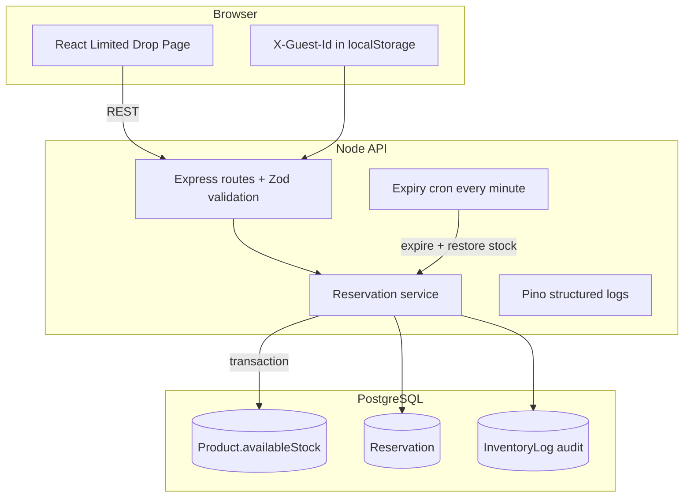

# StockGuard

Limited-stock product drop system for high-concurrency reservations. When many shoppers hit **Reserve** at the same time, inventory stays correct, holds expire after five minutes, and stock never goes negative.

| Link | URL |
|------|-----|
| Repository | [github.com/Habimana06/StockGuard](https://github.com/Habimana06/StockGuard) |
| Deploy (Pxxl) | _Add your `https://*.pxxl.app` URL after deploy_ |

## Quick start (Docker)

```bash
cp .env.example .env
# Set JWT_SECRET to a long random string in .env
docker compose up --build
```

| Service | URL |
|---------|-----|
| Web UI | http://localhost:5173 |
| API | http://localhost:4000 |
| Health | http://localhost:4000/health |
| Metrics | http://localhost:4000/metrics |

### Local development (without Docker)

```bash
# Terminal 1 — database
docker compose up postgres -d

# Terminal 2 — API
cd backend && npm install
cp ../.env.example .env
npx prisma migrate deploy && npm run db:seed
npm run dev

# Terminal 3 — UI
cd frontend && npm install
npm run dev
```

## Architecture



## API overview

| Method | Path | Description |
|--------|------|-------------|
| GET | `/health` | Liveness + DB check |
| GET | `/metrics` | Simple in-process counters |
| GET | `/products` | List products (pagination, filter, sort) |
| GET | `/products/:id` | Product + active reservation for user |
| POST | `/api/reserve` | Hold stock (`productId`, `quantity`) |
| POST | `/api/checkout` | Complete purchase (`reservationId`) |
| POST | `/auth/register` | JWT registration (bonus) |
| POST | `/auth/login` | JWT login (bonus) |

Send `X-Guest-Id` (any stable string ≥ 8 chars) for the drop page without login, or `Authorization: Bearer <token>` after auth.

## Race conditions — how we prevent overselling

1. **Atomic stock decrement** — `UPDATE product SET availableStock = availableStock - qty WHERE id = ? AND availableStock >= qty`. If zero rows match, the request fails with `409`. No read-modify-write race.
2. **Serializable business rules in one transaction** — duplicate active reservation check, decrement, reservation row, and inventory log are committed together.
3. **Expiry before reserve/checkout** — stale holds are released first so `availableStock` reflects reality.
4. **Concurrency test** — Vitest fires 25 parallel reserves on 10 units; exactly 10 succeed.

## Schema decisions

| Model | Why |
|-------|-----|
| **Product.availableStock** | Single counter for “what can still be reserved” — updated only inside transactions. |
| **Reservation** | Temporary hold with `expiresAt` and `status` lifecycle (`ACTIVE` → `COMPLETED` / `EXPIRED`). |
| **Order** | Immutable sale record linked 1:1 to a completed reservation. |
| **InventoryLog** | Append-only audit trail for reserve, release, checkout, seed. |
| **User** | Supports JWT accounts; guests map via `guest-{id}@stockguard.local` email upsert. |

## Trade-offs

| Choice | Benefit | Cost |
|--------|---------|------|
| Postgres row-level `updateMany` vs Redis lock | Strong consistency, simpler ops | DB becomes hot spot under extreme load |
| In-process cron vs queue | Easy Docker/Render deploy | Multiple API replicas need external cron or leader election |
| Guest header vs forced login | Faster UX for assessment demo | Weaker identity than full auth |
| In-memory `/metrics` | Zero dependencies | Not shared across instances |

## What breaks at ~10,000 concurrent users

- **Postgres connection pool** — default pool exhausts; queries queue and time out.
- **Single API instance** — CPU on JSON + Prisma; rate limiter is per-process.
- **Row lock contention** — all reserves hit one `Product` row for a drop.
- **Cron duplication** — N replicas expire the same rows unless only one runs cron.
- **No CDN/cache** — product reads hit DB every 5s per client.

## Scaling plan

1. **Read path** — cache product stock in Redis with short TTL; pub/sub push updates to websockets instead of 5s polling.
2. **Write path** — shard hot SKU or use Redis `DECR` + async Postgres reconciliation for drops.
3. **Workers** — move expiry to a dedicated job consumer (BullMQ / SQS).
4. **API** — horizontal pods behind load balancer; sticky sessions optional for guests.
5. **DB** — read replicas for listings; connection pooling (PgBouncer).
6. **Observability** — Prometheus + Grafana instead of in-memory counters.

## Testing

```bash
cd backend && npm test    # needs Postgres (docker compose up postgres -d)
cd frontend && npm test
```

## Deploying to Pxxl

1. Push this repo to GitHub.
2. Create services on [pxxl.app](https://pxxl.app/) for API + static frontend (or full Docker image).
3. Set `DATABASE_URL`, `JWT_SECRET`, `CORS_ORIGIN` to your Pxxl URLs.
4. Run migrations on deploy (`prisma migrate deploy`).
5. Optional: Render cron hitting `POST /internal/expire` — we use in-app `node-cron` so the API self-heals without extra infra.

## Loom walkthrough

Record a 5–8 minute video covering: architecture diagram, reserve → countdown → checkout, concurrency test, and README trade-offs.

---

Built for the Full-Stack Developer Test — StockGuard © 2026
